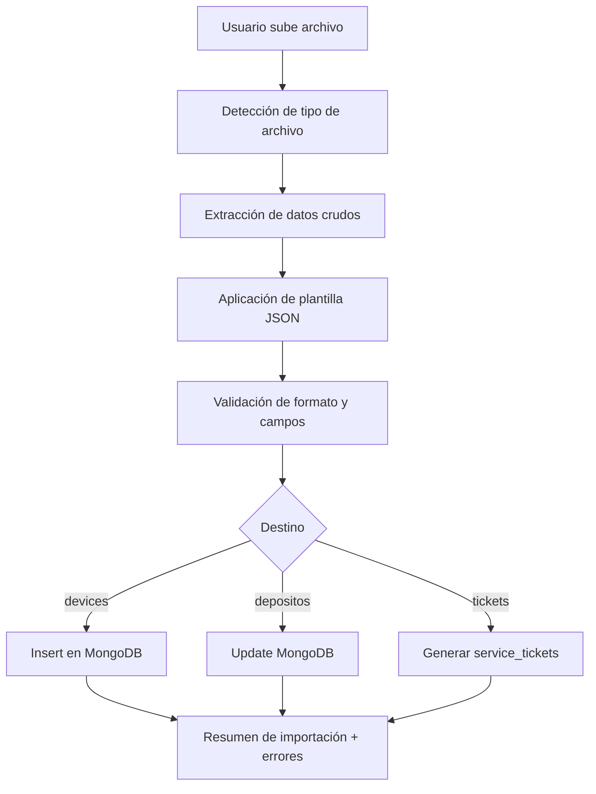

✅ Documento generado: **App4 Import Transform**
# 📄 Documento de Especificaciones

## Aplicación 4 – Importación y Transformación de Documentos

---

## 🚀 1. Propósito General

La Aplicación 4 permite a usuarios cargar **documentos estructurados o semiestructurados** (CSV, Excel, PDF) para transformarlos a un formato JSON homogéneo definido por Oversun y compatible con la base de datos de AssetFlow.

La finalidad es importar datos externos (reportes de venta, stock, movimientos, registros de terceros) que luego se integran en colecciones como `devices`, `depositos`, `inventario` o `service_tickets`.

---

## 📂 2. Tipos de Archivo Soportados

| Formato | Tratamiento                   | Tecnología usada           |
| ------- | ----------------------------- | -------------------------- |
| `.csv`  | Lectura directa y mapeo       | `pandas`, `csv.DictReader` |
| `.xlsx` | Lectura por hoja / encabezado | `openpyxl`, `pandas`       |
| `.pdf`  | OCR y parseo de tablas        | `pdfplumber`, `Tesseract`  |

> El sistema convierte todos los formatos a JSON, según una plantilla de transformación definida previamente.

---

## 🔧 3. Flujo de Transformación



---

## 🛂 4. Plantillas JSON de Transformación

Cada tipo de documento tiene una plantilla que indica:

* Columnas origen ↔ campos destino
* Tipos de datos esperados
* Reglas de validación
* Conversión de formatos (fechas, números, booleanos)

### Ejemplo: plantilla para importación de stock

```json
{
  "tipo": "inventario",
  "mapeo": {
    "Producto": "nombre",
    "Cantidad": "stock",
    "Ref": "sku",
    "Ubicacion": "ubicacion"
  },
  "validacion": {
    "stock": { "tipo": "numero", "min": 0 },
    "sku": { "tipo": "texto", "longitud": 8 }
  }
}
```

---

## 📚 5. Uso Web o API

### Interfaz Web:

* Subida de archivo
* Selección de plantilla (manual o automática por nombre)
* Vista previa transformada
* Botón "Importar"

### API REST:

| Método | Ruta                     | Descripción                     |
| ------ | ------------------------ | ------------------------------- |
| POST   | `/api/transformar`       | Sube y transforma sin guardar   |
| POST   | `/api/importar/:destino` | Sube, transforma e inserta      |
| GET    | `/api/plantillas`        | Lista de plantillas disponibles |

---

## 🔐 6. Seguridad

* Solo usuarios autenticados (JWT)
* Validación de contenido antes de inserción
* Límite de tamaño de archivo (10MB)
* Control de errores (log de errores por usuario)

---

## 🌟 7. Destinos compatibles

| Destino           | Colección MongoDB | Observaciones                    |
| ----------------- | ----------------- | -------------------------------- |
| `devices`         | `devices`         | Inserta IMEI, ICCID, orden, etc. |
| `inventario`      | `inventory`       | Inserta o actualiza SKU          |
| `service_tickets` | `service_tickets` | Genera incidencias               |
| `depositos`       | `depositos`       | Asigna productos a ubicaciones   |
| `clientes`        | `customers`       | Altas masivas de clientes        |

---

## 🚀 8. Futuras funcionalidades

* OCR de códigos de barras para extraer SKU
* Aprendizaje de plantillas (machine learning)
* Reversión de importaciones por ID
* Interfaz de comparación previa/posterior
* Detección automática de plantilla por heurística

---

## 📅 9. Versión y Estado

* Versión: `v1.0.0`
* Web operativa
* API REST funcional
* Plantillas configuradas por JSON
* Integrado con MongoDB (`devices`, `inventory`, etc.)

---

## 🔹 10. Referencias

* Arquitectura general: `ARQUITECTURA_MONGODB.md`【101†source】
* Ejemplo de integración documental: `GUIA_MIGRACION_DETALLADA.md`【102†source】
* Diagrama de flujo: `DIAGRAMAS.md`【104†source】
