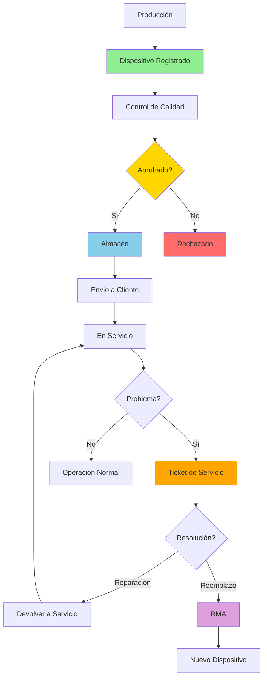
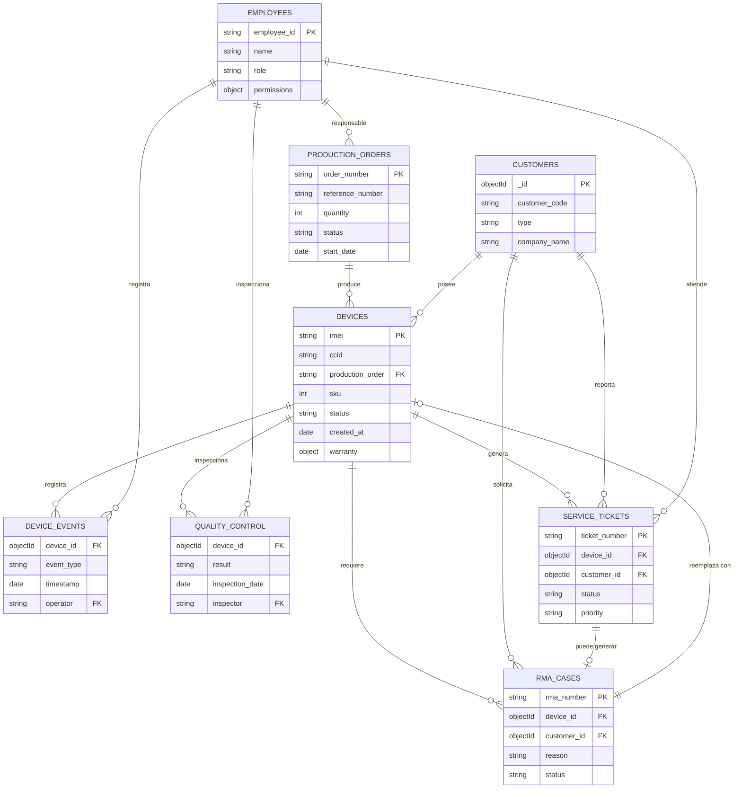
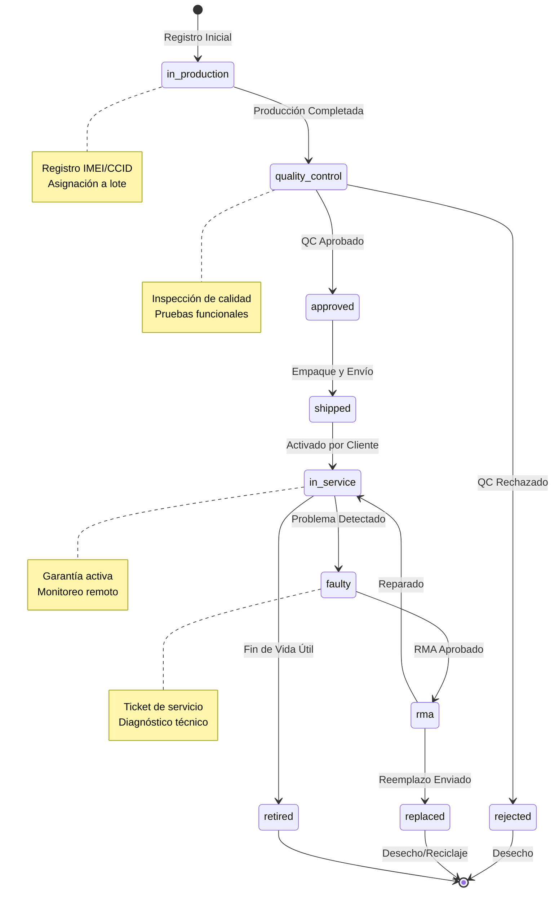
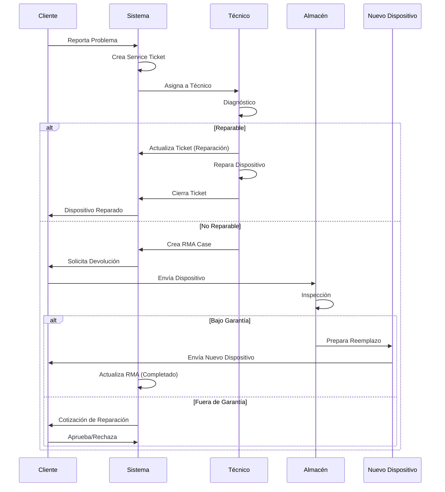
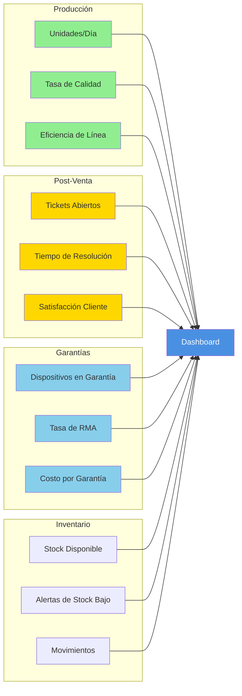
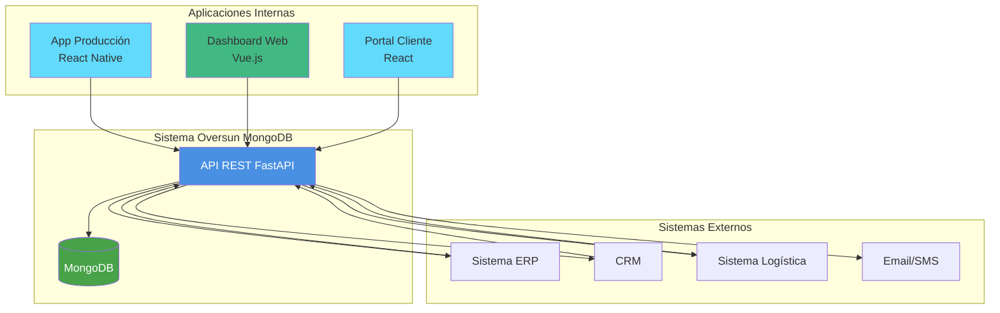
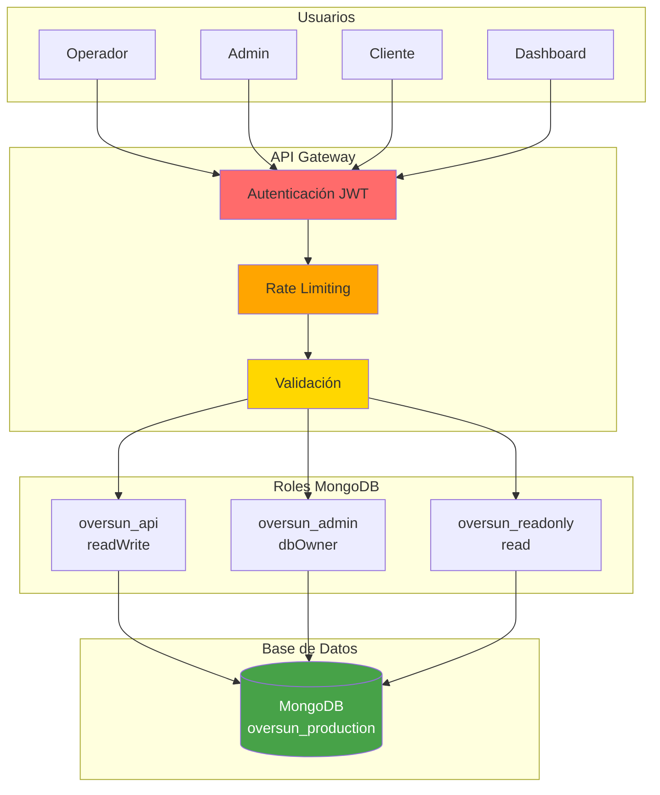

# Diagramas de Arquitectura - Oversun Energy

## 1. Flujo de Datos Principal

## 2. Estructura de Colecciones MongoDB

## 3. Ciclo de Vida del Dispositivo

## 4. Proceso de Post-Venta

## 5. Dashboard de Métricas (Vista Conceptual)

## 6. Integración con Sistemas Externos

## 7. Arquitectura de Seguridad

## Notas de Implementación

### Leyenda de Colores
- 🟢 Verde: Procesos de producción y aprobación
- 🟡 Amarillo: Validación y decisiones
- 🔵 Azul: Almacenamiento y datos
- 🟠 Naranja: Alertas y problemas
- 🟣 Morado: Procesos de RMA

### Convenciones
- **PK**: Primary Key (Clave única)
- **FK**: Foreign Key (Referencia a otra colección)
- **→**: Flujo de datos unidireccional
- **↔**: Comunicación bidireccional
- **||--o{**: Relación uno a muchos
