# Diagramas de Arquitectura - Oversun Energy

## 1. Flujo de Datos Principal

```mermaid
graph TB
    A[Producción] --> B[Dispositivo Registrado]
    B --> C[Control de Calidad]
    C --> D{Aprobado?}
    D -->|Sí| E[Almacén]
    D -->|No| F[Rechazado]
    E --> G[Envío a Cliente]
    G --> H[En Servicio]
    H --> I{Problema?}
    I -->|Sí| J[Ticket de Servicio]
    I -->|No| K[Operación Normal]
    J --> L{Resolución?}
    L -->|Reparación| M[Devolver a Servicio]
    L -->|Reemplazo| N[RMA]
    N --> O[Nuevo Dispositivo]
    M --> H
    
    style B fill:#90EE90
    style D fill:#FFD700
    style F fill:#FF6B6B
    style E fill:#87CEEB
    style J fill:#FFA500
    style N fill:#DDA0DD
```

## 2. Estructura de Colecciones MongoDB

## 3. Ciclo de Vida del Dispositivo

```mermaid
stateDiagram-v2
    [*] --> in_production: Registro Inicial
    in_production --> quality_control: Producción Completada
    quality_control --> approved: QC Aprobado
    quality_control --> rejected: QC Rechazado
    rejected --> [*]: Desecho
    approved --> shipped: Empaque y Envío
    shipped --> in_service: Activado por Cliente
    in_service --> faulty: Problema Detectado
    faulty --> rma: RMA Aprobado
    rma --> replaced: Reemplazo Enviado
    rma --> in_service: Reparado
    replaced --> [*]: Desecho/Reciclaje
    in_service --> retired: Fin de Vida Útil
    retired --> [*]
    
    note right of in_production
        Registro IMEI/CCID
        Asignación a lote
    end note
    
    note right of quality_control
        Inspección de calidad
        Pruebas funcionales
    end note
    
    note right of in_service
        Garantía activa
        Monitoreo remoto
    end note
    
    note right of faulty
        Ticket de servicio
        Diagnóstico técnico
    end note
```

## 4. Proceso de Post-Venta

```mermaid
sequenceDiagram
    participant C as Cliente
    participant S as Sistema
    participant T as Técnico
    participant A as Almacén
    participant N as Nuevo Dispositivo
    
    C->>S: Reporta Problema
    S->>S: Crea Service Ticket
    S->>T: Asigna a Técnico
    T->>T: Diagnóstico
    
    alt Reparable
        T->>S: Actualiza Ticket (Reparación)
        T->>T: Repara Dispositivo
        T->>S: Cierra Ticket
        S->>C: Dispositivo Reparado
    else No Reparable
        T->>S: Crea RMA Case
        S->>C: Solicita Devolución
        C->>A: Envía Dispositivo
        A->>A: Inspección
        alt Bajo Garantía
            A->>N: Prepara Reemplazo
            N->>C: Envía Nuevo Dispositivo
            S->>S: Actualiza RMA (Completado)
        else Fuera de Garantía
            S->>C: Cotización de Reparación
            C->>S: Aprueba/Rechaza
        end
    end
```

## 5. Dashboard de Métricas (Vista Conceptual)

```mermaid
graph LR
    subgraph "Producción"
        P1[Unidades/Día]
        P2[Tasa de Calidad]
        P3[Eficiencia de Línea]
    end
    
    subgraph "Post-Venta"
        PS1[Tickets Abiertos]
        PS2[Tiempo de Resolución]
        PS3[Satisfacción Cliente]
    end
    
    subgraph "Garantías"
        W1[Dispositivos en Garantía]
        W2[Tasa de RMA]
        W3[Costo por Garantía]
    end
    
    subgraph "Inventario"
        I1[Stock Disponible]
        I2[Alertas de Stock Bajo]
        I3[Movimientos]
    end
    
    P1 --> D[Dashboard]
    P2 --> D
    P3 --> D
    PS1 --> D
    PS2 --> D
    PS3 --> D
    W1 --> D
    W2 --> D
    W3 --> D
    I1 --> D
    I2 --> D
    I3 --> D
    
    style D fill:#4A90E2,color:#fff
    style P1 fill:#90EE90
    style P2 fill:#90EE90
    style P3 fill:#90EE90
    style PS1 fill:#FFD700
    style PS2 fill:#FFD700
    style PS3 fill:#FFD700
    style W1 fill:#87CEEB
    style W2 fill:#87CEEB
    style W3 fill:#87CEEB
```

## 6. Integración con Sistemas Externos

```mermaid
graph TB
    subgraph "Sistema Oversun MongoDB"
        API[API REST FastAPI]
        DB[(MongoDB)]
        API --> DB
    end
    
    subgraph "Aplicaciones Internas"
        APP1[App Producción<br/>React Native]
        APP2[Dashboard Web<br/>Vue.js]
        APP3[Portal Cliente<br/>React]
    end
    
    subgraph "Sistemas Externos"
        ERP[Sistema ERP]
        CRM[CRM]
        LOG[Sistema Logística]
        EMAIL[Email/SMS]
    end
    
    APP1 --> API
    APP2 --> API
    APP3 --> API
    
    ERP --> API
    API --> ERP
    
    CRM --> API
    API --> CRM
    
    LOG --> API
    API --> LOG
    
    API --> EMAIL
    
    style API fill:#4A90E2,color:#fff
    style DB fill:#47A248,color:#fff
    style APP1 fill:#61DAFB
    style APP2 fill:#42B883
    style APP3 fill:#61DAFB
```

## 7. Arquitectura de Seguridad

## Notas de Implementación

### Leyenda de Colores
- 🟢 Verde: Procesos de producción y aprobación
- 🟡 Amarillo: Validación y decisiones
- 🔵 Azul: Almacenamiento y datos
- 🟠 Naranja: Alertas y problemas
- 🟣 Morado: Procesos de RMA

### Convenciones
- **PK**: Primary Key (Clave única)
- **FK**: Foreign Key (Referencia a otra colección)
- **→**: Flujo de datos unidireccional
- **↔**: Comunicación bidireccional
- **||--o{**: Relación uno a muchos
